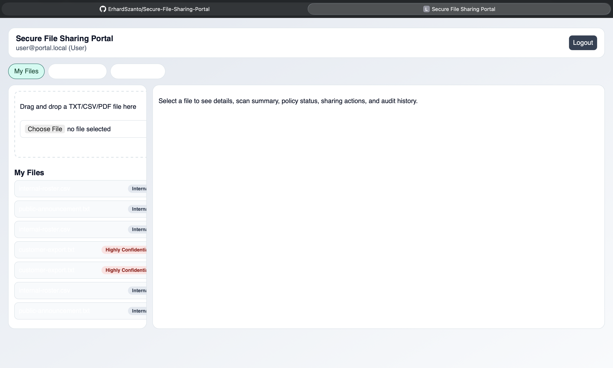
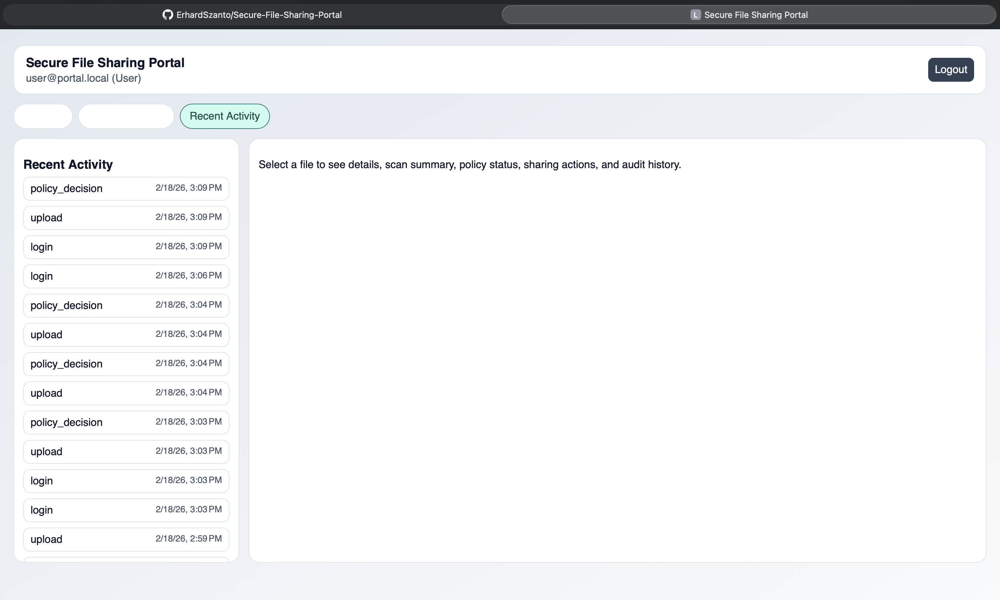
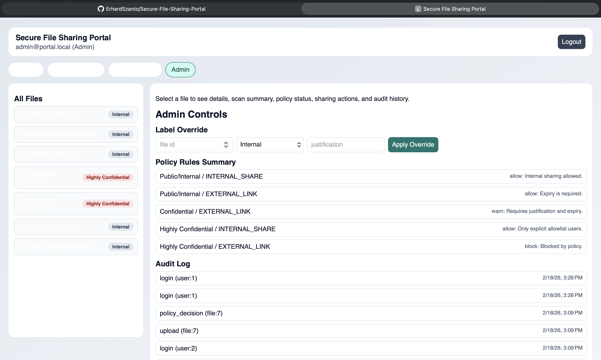

# Secure File Sharing Portal

A portfolio-ready internal file sharing application that demonstrates DLP-inspired controls:
- Upload documents (`TXT`, `CSV`, `PDF`) and run basic PII scanning.
- Assign sensitivity labels (`Public`, `Internal`, `Confidential`, `Highly Confidential`).
- Enforce policy outcomes (`allow`, `warn`, `block`) for sharing actions.
- Track complete audit trails and export compliance reports.

## Tech Stack
- Backend: FastAPI + SQLAlchemy + SQLite
- Frontend: Angular + TypeScript
- Auth: JWT + RBAC (`Admin`, `User`)
- Storage: local filesystem for file blobs, DB metadata in SQLite
- Tests: pytest for policy/scanner/upload validation

## Screenshot Placeholders
- 
- 
- 
- 

## Repository Layout
```text
/backend     FastAPI app (routers, models, scanner, policy engine, tests)
/frontend    Angular application
/docs        Architecture, threat model, API reference
/demo-data   Safe dummy files used by seed/demo mode
```

## Local Run (No Docker)

## 1) Backend (`http://localhost:8000`)
```bash
cd /Users/erhardszanto/Documents/New\ project/backend
./scripts/bootstrap.sh
./scripts/dev.sh
```

Environment variables (safe defaults already implemented):
- `DATABASE_URL` default: `sqlite:///./app.db`
- `UPLOAD_DIR` default: `./uploads`
- `CORS_ORIGINS` default: `http://localhost:4200`

## 2) Frontend (`http://localhost:4200`)
```bash
cd /Users/erhardszanto/Documents/New\ project/frontend
npm install
npm start
```

## Demo Users (seeded on backend startup)
- Admin: `admin@portal.local` / `Admin123!`
- User: `user@portal.local` / `User123!`
- Additional user for sharing tests: `analyst@portal.local` / `Analyst123!`

## What Seed Mode Adds
- Demo users above
- Initial files from `/demo-data`
- Initial upload audit entries

## Security Notes
- Scanner stores only redacted examples and category counts.
- `storage_path` stays server-side and is not returned in file metadata APIs.
- All key actions are audit-logged (`login`, `upload`, `download`, sharing actions, policy decisions, label overrides, report exports).
- PDF scanning is intentionally limited in v1 (filename + trivial text preview only).
- Replace `JWT_SECRET_KEY` before any non-local deployment.

## Compliance Reporting
- Date-range CSV export: `/reports/audit.csv?from=YYYY-MM-DD&to=YYYY-MM-DD`
- Per-file audit timeline CSV export: `/reports/files/{id}/audit.csv`

## Tests
```bash
cd /Users/erhardszanto/Documents/New\ project/backend
./scripts/test.sh
```

Covered tests:
- Policy decision matrix
- Scanner redaction + label mapping
- Upload filename allowlist validation

## Architecture Diagram
See `/docs/architecture.md` for the full component breakdown and ASCII diagram.

## Troubleshooting
- `curl http://localhost:8000/health` cannot connect:
  - Ensure backend is running from a terminal with `./scripts/dev.sh`.
  - If startup fails with missing packages, run `./scripts/bootstrap.sh` first.
- VS Code says `pytest` not found:
  - This repo includes `.vscode/settings.json` pointing to `backend/.venv/bin/python`.
  - Run `./scripts/bootstrap.sh` once to install `pytest` in that environment.
  - In VS Code, run `Python: Select Interpreter` and pick `/Users/erhardszanto/Documents/New project/backend/.venv/bin/python` if needed.
